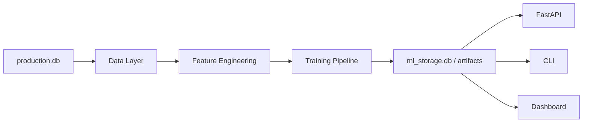
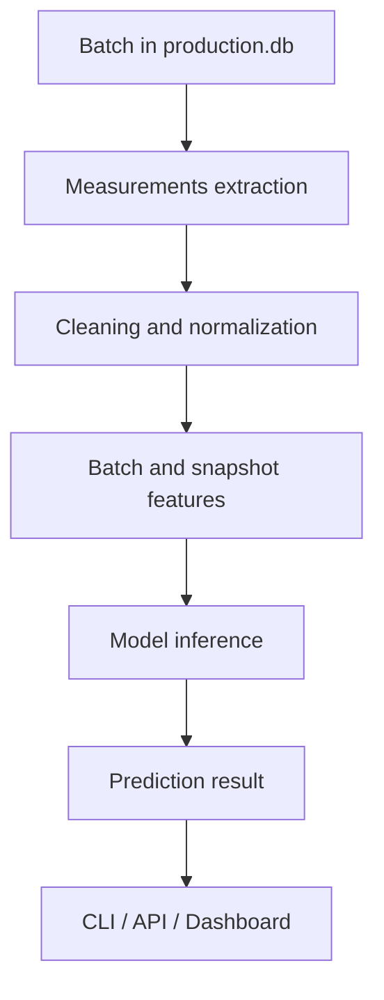
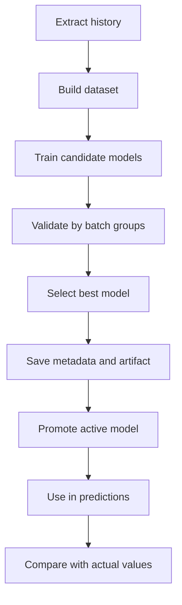
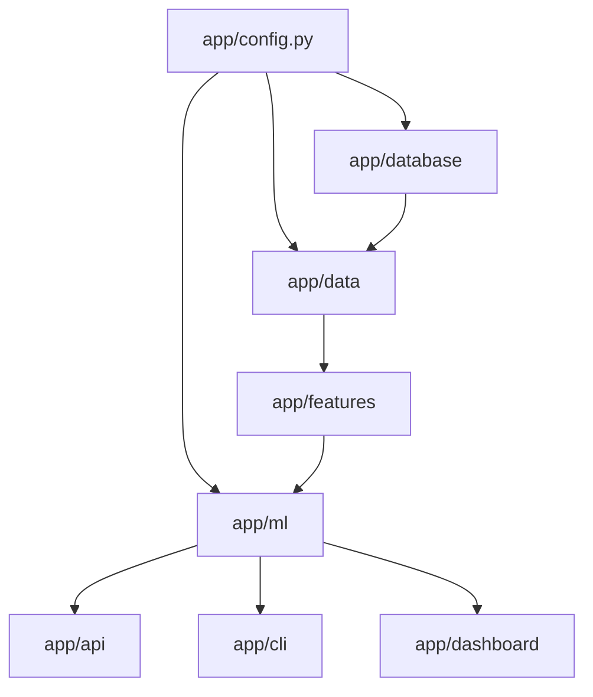

# Диаграммы системы

Этот раздел помогает быстро понять устройство системы визуально. Диаграммы сделаны в формате Mermaid, чтобы их можно было поддерживать прямо в репозитории.

## Общая архитектура

Смысл диаграммы:

- производственная база является источником фактов
- data layer очищает и подготавливает данные
- feature engineering собирает признаки
- training pipeline создаёт модели
- сохранённые модели используются всеми интерфейсами доступа

## Поток данных от партии к прогнозу

Эта схема показывает рабочий путь данных в момент прогноза.

## Жизненный цикл модели

Эта диаграмма полезна для понимания MLOps-контура системы даже в MVP-формате.

## Архитектура модулей проекта

## Когда диаграммы особенно полезны

- при онбординге нового участника команды
- при обсуждении архитектуры с бизнесом или технологами
- при подготовке презентации проекта
- при планировании следующих этапов развития
